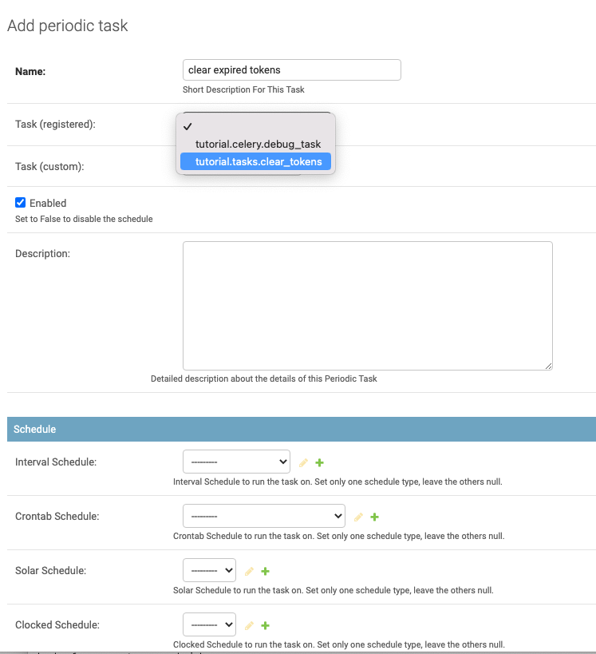

# Django OAuth Toolkit Tutorial

Use this repo for testing DOT functionality.

It is based on this [tutorial](https://django-oauth-toolkit.readthedocs.io/en/latest/tutorial/tutorial_01.html)

<!-- toc -->

- [Start the Demo](#start-the-demo)
- [Continue the demo](#continue-the-demo)
- [Test the OIDC Userinfo Endpoint with Postman](#test-the-oidc-userinfo-endpoint-with-postman)
  * [Run the server](#run-the-server)
  * [Configure Postman for OAuth2](#configure-postman-for-oauth2)
  * [Request new token -- Django login redirect](#request-new-token----django-login-redirect)
  * [Request new token -- OAuth2 scope approval](#request-new-token----oauth2-scope-approval)
  * [Request new token -- It worked!](#request-new-token----it-worked)
  * [Tell Postman to use the token](#tell-postman-to-use-the-token)
  * [Decode the id_token](#decode-the-id_token)
  * [Do a Userinfo lookup of the token](#do-a-userinfo-lookup-of-the-token)
- [Deploy on heroku](#deploy-on-heroku)
- [Add Celery automated task discovery](#add-celery-automated-task-discovery)
  * [Erroneous DOT PR to add Celery auto-discovered tasks.py](#erroneous-dot-pr-to-add-celery-auto-discovered-taskspy)
  * [Basic Celery setup](#basic-celery-setup)
  * [App changes](#app-changes)
  * [Start RabbitMQ](#start-rabbitmq)
  * [Start Celery Beat](#start-celery-beat)
  * [Start Celery Worker](#start-celery-worker)

<!-- tocstop -->

## Start the Demo

Simply run `tox` to configure and run the demo with a preloaded user and OAuth2 application defined.

The user is `admin` with password `admin123`.

The application's name is `hashed secret`, the `client_id` is `hash1` with `client_secret` of `hashed`.


```
(venv) dot-tutorial$ tox
py39 create: /Users/ac45/src/dot-tutorial/venv
py39 installdeps: -rrequirements.txt
py39 develop-inst: /Users/ac45/src/dot-tutorial
py39 installed: asgiref==3.4.1,black==21.12b0,certifi==2021.10.8,cffi==1.15.0,charset-normalizer==2.0.10,click==8.0.3,cryptography==36.0.1,Deprecated==1.2.13,Django==4.0.1,django-cors-headers==3.10.1,django-oauth-toolkit @ file:///Users/ac45/src/django-oauth-toolkit,idna==3.3,jwcrypto==1.0,mypy-extensions==0.4.3,oauthlib==3.1.1,pathspec==0.9.0,platformdirs==2.4.1,pycparser==2.21,PyYAML==6.0,requests==2.27.1,sqlparse==0.4.2,tomli==1.2.3,typing_extensions==4.0.1,-e git+ssh://git@github.com/n2ygk/dot-tutorial.git@8686c493c1003584634373818b9cd2e806ae7b72#egg=UNKNOWN,urllib3==1.26.8,wrapt==1.13.3
py39 run-test-pre: PYTHONHASHSEED='1698771071'
py39 run-test: commands[0] | ./manage.py migrate
Operations to perform:
Apply all migrations: admin, auth, contenttypes, oauth2_provider, sessions
Running migrations:
Applying contenttypes.0001_initial... OK
Applying auth.0001_initial... OK
Applying admin.0001_initial... OK
Applying admin.0002_logentry_remove_auto_add... OK
Applying admin.0003_logentry_add_action_flag_choices... OK
Applying contenttypes.0002_remove_content_type_name... OK
Applying auth.0002_alter_permission_name_max_length... OK
Applying auth.0003_alter_user_email_max_length... OK
Applying auth.0004_alter_user_username_opts... OK
Applying auth.0005_alter_user_last_login_null... OK
Applying auth.0006_require_contenttypes_0002... OK
Applying auth.0007_alter_validators_add_error_messages... OK
Applying auth.0008_alter_user_username_max_length... OK
Applying auth.0009_alter_user_last_name_max_length... OK
Applying auth.0010_alter_group_name_max_length... OK
Applying auth.0011_update_proxy_permissions... OK
Applying auth.0012_alter_user_first_name_max_length... OK
Applying oauth2_provider.0001_initial... OK
Applying oauth2_provider.0002_auto_20190406_1805... OK
Applying oauth2_provider.0003_auto_20201211_1314... OK
Applying oauth2_provider.0004_auto_20200902_2022... OK
Applying oauth2_provider.0005_auto_20211222_2352... OK
Applying oauth2_provider.0006_alter_application_client_secret... OK
Applying sessions.0001_initial... OK
py39 run-test: commands[2] | ./manage.py loaddata fixtures/auth.user.yaml fixtures/oauth2_provider.application.yaml
Installed 2 object(s) from 2 fixture(s)
py39 run-test: commands[3] | ./manage.py runserver
Watching for file changes with StatReloader
Performing system checks...

System check identified no issues (0 silenced).
January 08, 2022 - 21:19:56
Django version 4.0.1, using settings 'tutorial.settings'
Starting development server at http://127.0.0.1:8000/
Quit the server with CONTROL-C.
```

## Continue the demo

After quitting the demo, you can mess around and restart it with:

```
dot-tutorial$ source venv/bin/activate
(venv) dot-tutorial$ ./manage.py runserver
Watching for file changes with StatReloader
Performing system checks...

System check identified no issues (0 silenced).
January 08, 2022 - 21:22:18
Django version 4.0.1, using settings 'tutorial.settings'
Starting development server at http://127.0.0.1:8000/
Quit the server with CONTROL-C.
```

## Test the OIDC Userinfo Endpoint with Postman

Following is an example of testing OIDC Authorization Code flow to login with this demo setup and
then interrogate the Userinfo endpoint.

It uses [Postman](https://www.postman.com/downloads/), the Swiss Army Knife of the Internet.

### Run the server

```
(venv) dot-tutorial$ ./manage.py runserver
```

### Configure Postman for OAuth2


### Request new token -- Django login redirect


### Request new token -- OAuth2 scope approval


### Request new token -- It worked!


### Tell Postman to use the token


### Decode the id_token


### Do a Userinfo lookup of the token


## Deploy on heroku

See https://devcenter.heroku.com/articles/getting-started-with-python and then tweak a few files:

- Procfile
- app.json
- release-tasks.sh
- requirements.txt

The basic heroku CLI commands used are:

```
heroku apps:create
heroku apps:rename dot-tutorial
git push heroku main
heroku config:set DJANGO_DEBUG=false
heroku config:set DOT_PKCE=false
heroku config:set OIDC_RSA_PRIVATE_KEY="`cat oidc.key`"
heroku logs -t
```

## Add Celery automated task discovery

### Erroneous DOT PR to add Celery auto-discovered tasks.py

DOT PR [#1070](https://github.com/jazzband/django-oauth-toolkit/pull/1070) purported to add a Celery auto-loaded
task to cleartokens but did not provide enough of an example or test case and,  based on
[#1123](https://github.com/jazzband/django-oauth-toolkit/pull/1123), it has become clear that it never worked.

Given the above error and the conflict with [Huey](https://github.com/coleifer/huey)
[#1114](https://github.com/jazzband/django-oauth-toolkit/issues/1114),
which also looks for `tasks.py` this PR will shortly be reverted.

Meanwhile, here's an example with the fix applied in [#1123](https://github.com/jazzband/django-oauth-toolkit/pull/1123).

<!-- this domain is SNAFU:
https://docs.celeryproject.org/en/stable/django/first-steps-with-django.html

https://docs.celeryproject.org/en/latest/userguide/periodic-tasks.html#using-custom-scheduler-classes
-->

### Basic Celery setup

Here are some documentation links to follow:

https://docs.celeryq.dev/en/stable/django/first-steps-with-django.html

https://docs.celeryq.dev/en/stable/userguide/periodic-tasks.html#beat-custom-schedulers

https://django-celery-beat.readthedocs.io/en/latest/index.html

The key steps are:
1. Add support in the Django admin to configure Celery.
2. Use Celery Beat for the task timing
3. Use RabbitMQ for the message queue.

### App changes

The required changes to this tutorial app are shown here as diffs:

```diff
diff --git a/requirements.txt b/requirements.txt
index 09951f9..59983f4 100644
--- a/requirements.txt
+++ b/requirements.txt
@@ -14,3 +14,5 @@ django-oauth-toolkit==1.7.0
 PyYAML
 django-heroku
 gunicorn
+celery>=5.2
+django-celery-beat
diff --git a/tutorial/__init__.py b/tutorial/__init__.py
index e69de29..fb989c4 100644
--- a/tutorial/__init__.py
+++ b/tutorial/__init__.py
@@ -0,0 +1,3 @@
+from .celery import app as celery_app
+
+__all__ = ('celery_app',)
diff --git a/tutorial/celery.py b/tutorial/celery.py
new file mode 100644
index 0000000..3f5f1c9
--- /dev/null
+++ b/tutorial/celery.py
@@ -0,0 +1,22 @@
+import os
+
+from celery import Celery
+
+# Set the default Django settings module for the 'celery' program.
+os.environ.setdefault('DJANGO_SETTINGS_MODULE', 'tutorial.settings')
+
+app = Celery('tutorial', broker="pyamqp://guest@localhost//")
+
+# Using a string here means the worker doesn't have to serialize
+# the configuration object to child processes.
+# - namespace='CELERY' means all celery-related configuration keys
+#   should have a `CELERY_` prefix.
+app.config_from_object('django.conf:settings', namespace='CELERY')
+
+# Load task modules from all registered Django apps.
+app.autodiscover_tasks()
+
+
+@app.task(bind=True)
+def debug_task(self):
+    print(f'Request: {self.request!r}')
diff --git a/tutorial/settings.py b/tutorial/settings.py
index 2fc7b41..7172e24 100644
--- a/tutorial/settings.py
+++ b/tutorial/settings.py
@@ -42,6 +42,7 @@ INSTALLED_APPS = [
     "django.contrib.staticfiles",
     "oauth2_provider",
     "corsheaders",
+    "django_celery_beat",
 ]
 
 MIDDLEWARE = [
```

Now the Django admin console will show some new Periodic Tasks:


Click "Add periodic task", pick a name and select from the list of registered tasks.




### Start RabbitMQ

Start up [rabbitmq](https://www.rabbitmq.com/download.html):

On MacOS:
```
$ brew install rabbitmq
$ brew services start rabbitmq
```

On other platforms there's a Docker image available:
```
docker run -it --rm --name rabbitmq -p 5672:5672 -p 15672:15672 rabbitmq:3.9-management
```

### Start Celery Beat

Then start up celery beat:
```
(env) dot-tutorial$ celery -A tutorial beat -l INFO --scheduler django_celery_beat.schedulers:DatabaseScheduler
celery beat v5.2.3 (dawn-chorus) is starting.
__    -    ... __   -        _
LocalTime -> 2022-03-18 21:39:12
Configuration ->
    . broker -> amqp://guest:**@localhost:5672//
    . loader -> celery.loaders.app.AppLoader
    . scheduler -> django_celery_beat.schedulers.DatabaseScheduler

    . logfile -> [stderr]@%INFO
    . maxinterval -> 5.00 seconds (5s)
[2022-03-18 21:39:12,078: INFO/MainProcess] beat: Starting...
```

Beat runs the task queue periodically and sends tasks via RabbitMQ to the worker.

### Start Celery Worker

Then start the worker which consumes the messages from the queue and executes them:

```
(env) dot-tutorial$ celery -A tutorial worker --loglevel=INFO
/Users/ac45/src/dot-tutorial/env/lib/python3.9/site-packages/celery/platforms.py:810: SecurityWarning: An entry for the specified gid or egid was not found.
We're assuming this is a potential security issue.

  warnings.warn(SecurityWarning(ASSUMING_ROOT))
/Users/ac45/src/dot-tutorial/env/lib/python3.9/site-packages/celery/platforms.py:840: SecurityWarning: You're running the worker with superuser privileges: this is
absolutely not recommended!

Please specify a different user using the --uid option.

User information: uid=1476831425 euid=1476831425 gid=1291818287 egid=1291818287

  warnings.warn(SecurityWarning(ROOT_DISCOURAGED.format(
 
 -------------- celery@082-AC45-M2 v5.2.3 (dawn-chorus)
--- ***** ----- 
-- ******* ---- macOS-12.3-x86_64-i386-64bit 2022-03-19 17:12:56
- *** --- * --- 
- ** ---------- [config]
- ** ---------- .> app:         tutorial:0x1046faac0
- ** ---------- .> transport:   amqp://guest:**@localhost:5672//
- ** ---------- .> results:     disabled://
- *** --- * --- .> concurrency: 8 (prefork)
-- ******* ---- .> task events: OFF (enable -E to monitor tasks in this worker)
--- ***** ----- 
 -------------- [queues]
                .> celery           exchange=celery(direct) key=celery
                

[tasks]
  . oauth2_provider.tasks.clear_tokens
  . tutorial.celery.debug_task

[2022-03-19 17:12:57,116: INFO/MainProcess] Connected to amqp://guest:**@127.0.0.1:5672//
[2022-03-19 17:12:57,131: INFO/MainProcess] mingle: searching for neighbors
[2022-03-19 17:12:58,169: INFO/MainProcess] mingle: all alone
[2022-03-19 17:12:58,186: WARNING/MainProcess] /Users/ac45/src/dot-tutorial/env/lib/python3.9/site-packages/celery/fixups/django.py:203: UserWarning: Using settings.DEBUG leads to a memory
            leak, never use this setting in production environments!
  warnings.warn('''Using settings.DEBUG leads to a memory

[2022-03-19 17:12:58,187: INFO/MainProcess] celery@082-AC45-M2 ready.
[2022-03-19 17:12:58,188: INFO/MainProcess] Task tutorial.celery.debug_task[63f16c50-ef33-41f8-bdc0-0216a8486466] received
[2022-03-19 17:12:58,188: INFO/MainProcess] Task oauth2_provider.tasks.clear_tokens[b69380b1-f6bd-4ed1-927e-8b2b7b2bfa14] received
[2022-03-19 17:12:58,292: WARNING/ForkPoolWorker-8] Request: <Context: {'lang': 'py', 'task': 'tutorial.celery.debug_task', 'id': '63f16c50-ef33-41f8-bdc0-0216a8486466', 'shadow': None, 'eta': None, 'expires': None, 'group': None, 'group_index': None, 'retries': 0, 'timelimit': [None, None], 'root_id': '63f16c50-ef33-41f8-bdc0-0216a8486466', 'parent_id': None, 'argsrepr': '()', 'kwargsrepr': '{}', 'origin': 'gen76730@082-AC45-M2', 'ignore_result': False, 'properties': {'content_type': 'application/json', 'content_encoding': 'utf-8', 'application_headers': {'lang': 'py', 'task': 'tutorial.celery.debug_task', 'id': '63f16c50-ef33-41f8-bdc0-0216a8486466', 'shadow': None, 'eta': None, 'expires': None, 'group': None, 'group_index': None, 'retries': 0, 'timelimit': [None, None], 'root_id': '63f16c50-ef33-41f8-bdc0-0216a8486466', 'parent_id': None, 'argsrepr': '()', 'kwargsrepr': '{}', 'origin': 'gen76730@082-AC45-M2', 'ignore_result': False}, 'delivery_mode': 2, 'priority': 0, 'correlation_id': '63f16c50-ef33-41f8-bdc0-0216a8486466', 'reply_to': '51d61210-7a3f-33db-8307-94683ce668e6'}, 'reply_to': '51d61210-7a3f-33db-8307-94683ce668e6', 'correlation_id': '63f16c50-ef33-41f8-bdc0-0216a8486466', 'hostname': 'celery@082-AC45-M2', 'delivery_info': {'exchange': '', 'routing_key': 'celery', 'priority': 0, 'redelivered': False}, 'args': [], 'kwargs': {}, 'is_eager': False, 'callbacks': None, 'errbacks': None, 'chain': None, 'chord': None, 'called_directly': False, '_protected': 1}>
[2022-03-19 17:12:58,292: INFO/ForkPoolWorker-1] refresh_expire_at is None. No refresh tokens deleted.
[2022-03-19 17:12:58,294: INFO/ForkPoolWorker-8] Task tutorial.celery.debug_task[63f16c50-ef33-41f8-bdc0-0216a8486466] succeeded in 0.0025927220000001583s: None
[2022-03-19 17:12:58,305: INFO/ForkPoolWorker-1] 0 Expired access tokens deleted
[2022-03-19 17:12:58,306: INFO/ForkPoolWorker-1] 0 Expired grant tokens deleted
[2022-03-19 17:12:58,307: INFO/ForkPoolWorker-1] Task oauth2_provider.tasks.clear_tokens[b69380b1-f6bd-4ed1-927e-8b2b7b2bfa14] succeeded in 0.015684232999999992s: None
...
```

